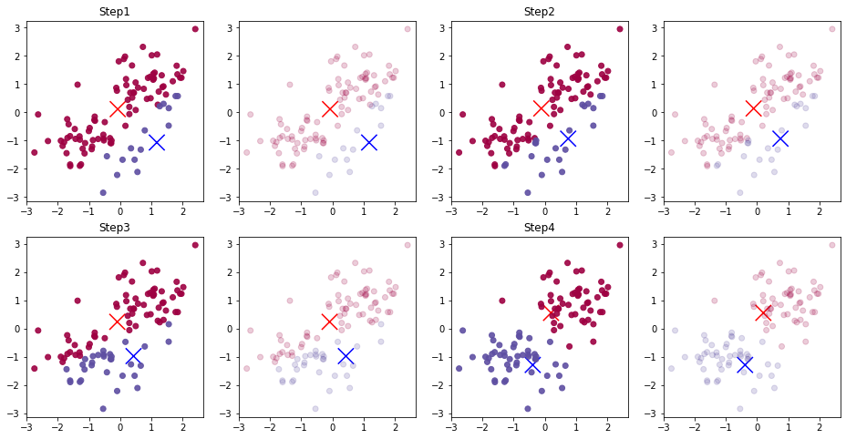
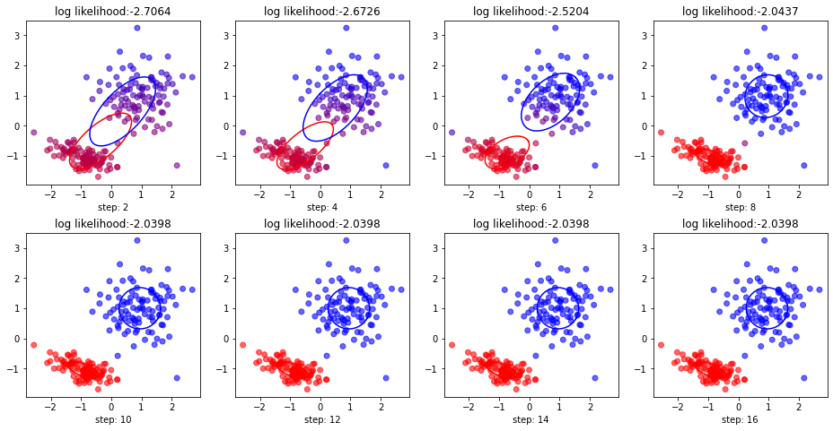
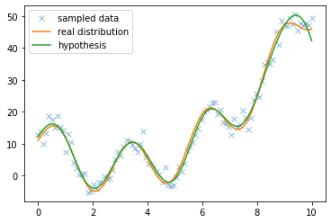
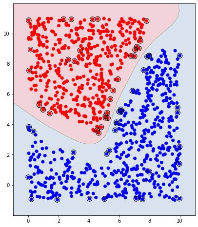
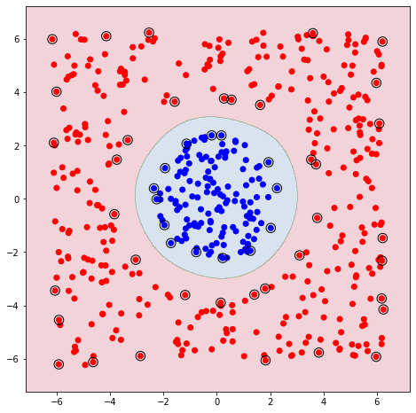

# ML exam study
Just for me to prepare for the final of my Machine Learning course.
 Contents: K-means, EM algorithm, linear regression and support vector machine with Gaussian kernel 

## K-means 

## EM algorithm for Gaussian Mixture Model

## Kernel regression 

## Support vector machine with Gaussian kenrel

